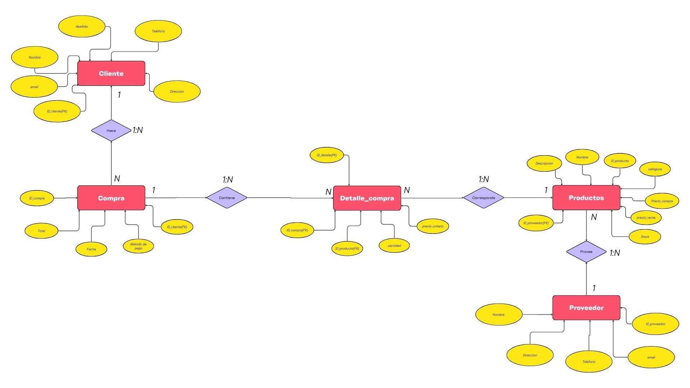
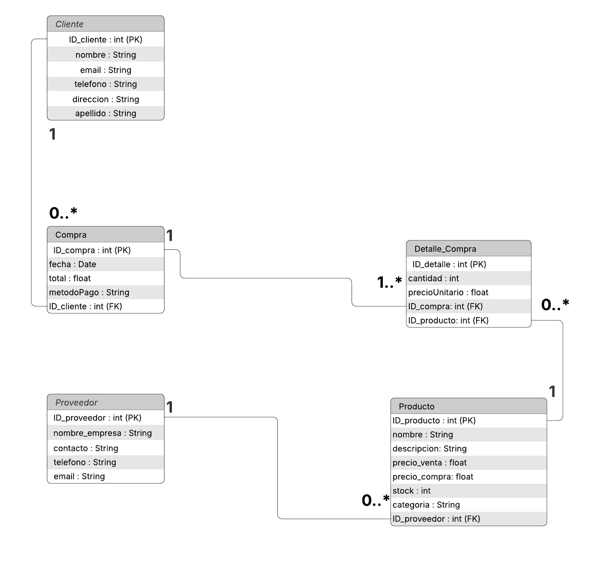

#  SIDE WALL BIKES - Sistema de Gestión de Inventario y Ventas

Este proyecto define la arquitectura de datos y el modelo relacional para el sistema de gestión de **SIDE WALL BIKES**, una tienda de ciclismo especializada en refacciones, mejoras y bicicletas para disciplinas como trail, enduro y downhill. 

El objetivo principal de este diseño es automatizar y centralizar el flujo de información comercial de la tienda, garantizando un control riguroso del inventario y un seguimiento preciso de las ventas.

---

##  Motivación del Proyecto

El mundo del ciclismo de montaña exige un manejo preciso de inventarios. Desde la venta de una bicicleta completa hasta la comercialización de componentes específicos y upgrades, la tienda requiere un sistema robusto, rápido y escalable.

Al sustituir registros manuales por esta base de datos relacional, la tienda logra:
- **Trazabilidad total:** Saber qué cliente compró qué componentes, en qué fecha y a qué precio.
- **Control de Stock en tiempo real:** Prevenir la venta de artículos agotados y optimizar los tiempos de reabastecimiento con proveedores.
- **Integridad de datos financieros:** Al registrar precios de compra y venta históricos, el sistema sienta las bases para calcular márgenes de ganancia y reportes de ventas.

---

##  Descripción General del Sistema

El sistema propuesto es una base de datos relacional (estructurada en Tercera Forma Normal - 3FN) diseñada específicamente para gestionar el ciclo completo de ventas y abastecimiento de la tienda. La arquitectura centraliza el catálogo de productos , el directorio de clientes y el registro de proveedores. 

El modelo resuelve eficientemente la relación natural de "muchos a muchos" que existe entre las compras de los clientes y los artículos del inventario mediante el uso de una tabla puente transaccional (`Detalle_Compra`). Esto permite que el sistema sea altamente escalable, dejando la estructura lista para integrarse en el futuro con un punto de venta (POS) físico o una plataforma de comercio electrónico.

---

##  Diagramas del Sistema

A continuación se presentan los diagramas que modelan la arquitectura del sistema:

### Diagrama Entidad-Relación (ER)

### Diagrama de Clases (UML)

---

##  Especificaciones Técnicas y Diccionario de Datos

El sistema se compone de 5 entidades principales conectadas de manera relacional:

### 1. Gestión de Usuarios
- **`Cliente`**: Almacena el directorio de compradores.
  - **PK:** `ID_cliente` (int)
  - **Atributos:** `nombre` (String), `apellido` (String), `email` (String), `telefono` (String), `direccion` (String).
  - *Relación:* `1` a `0..*` con `Compra`.

### 2. Motor Transaccional (Ventas)
- **`Compra`**: Funciona como el encabezado de la factura o ticket.
  - **PK:** `ID_compra` (int)
  - **FK:** `ID_cliente` (int)
  - **Atributos:** `fecha` (Date), `total` (float), `metodoPago` (String).
- **`Detalle_Compra`**: Tabla puente transaccional. Registra las partidas individuales de cada ticket, protegiendo el histórico de precios.
  - **PK:** `ID_detalle` (int)
  - **FK:** `ID_compra` (int), `ID_producto` (int)
  - **Atributos:** `cantidad` (int), `precioUnitario` (float).

### 3. Inventario y Cadena de Suministro
- **`Producto`**: El catálogo de refacciones, bicicletas y accesorios.
  - **PK:** `ID_producto` (int)
  - **FK:** `ID_proveedor` (int)
  - **Atributos:** `nombre` (String), `descripcion` (String), `precio_venta` (float), `precio_compra` (float), `stock` (int), `categoria` (String).
- **`Proveedor`**: Catálogo de distribuidores y marcas que surten a la tienda.
  - **PK:** `ID_proveedor` (int)
  - **Atributos:** `nombre_empresa` (String), `contacto` (String), `telefono` (String), `email` (String).

---
Con esto concluimos la expicacion de los diagramas.

Desarrollado por Santiago Basto Jimenez

